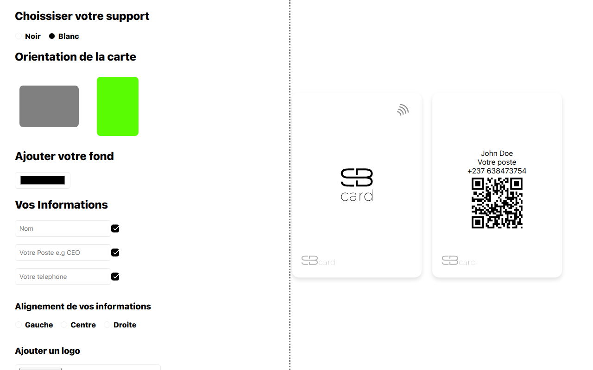

# SB Card

A simple clone of [WeMet WeCard app](https://app.wemet.fr/configurateur/personalize/original) made by me for my uncle ;)

Honestly, the code is sort of messy but well formatted. It shouldn't be an issue to understand what's going on inside (even for a beginner).

Contributions are welcome.

Built using Vite & React (with TypeScript, but not that much)

Clone the repository and install the dependencies with `npm install`.
Everything else, including static assets are available in the source.
